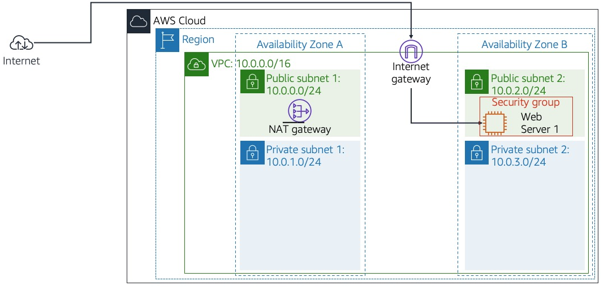
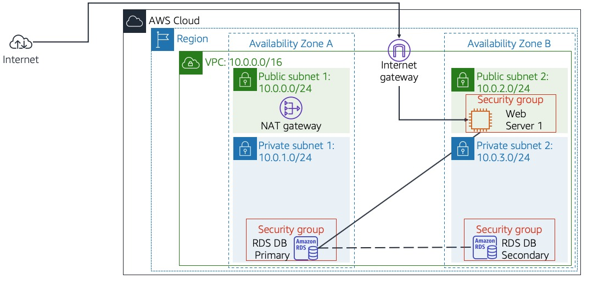
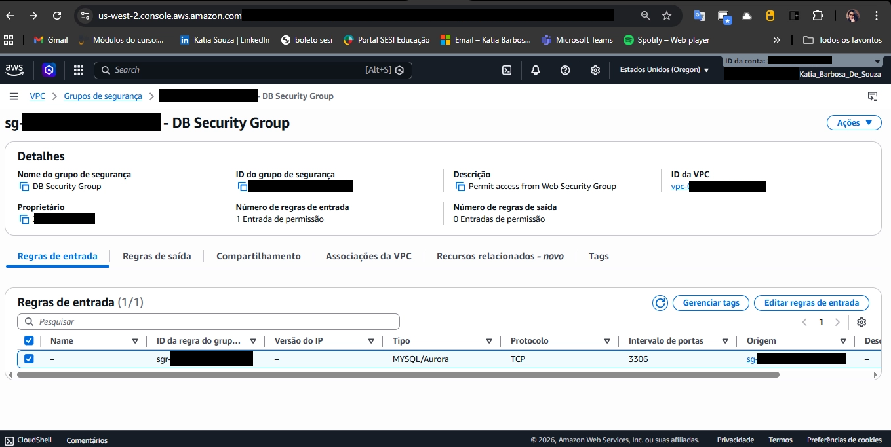
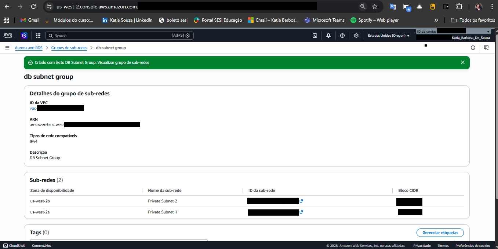
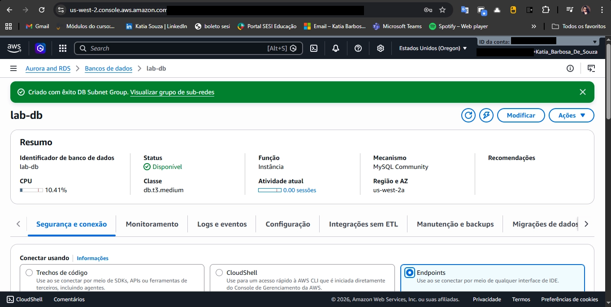
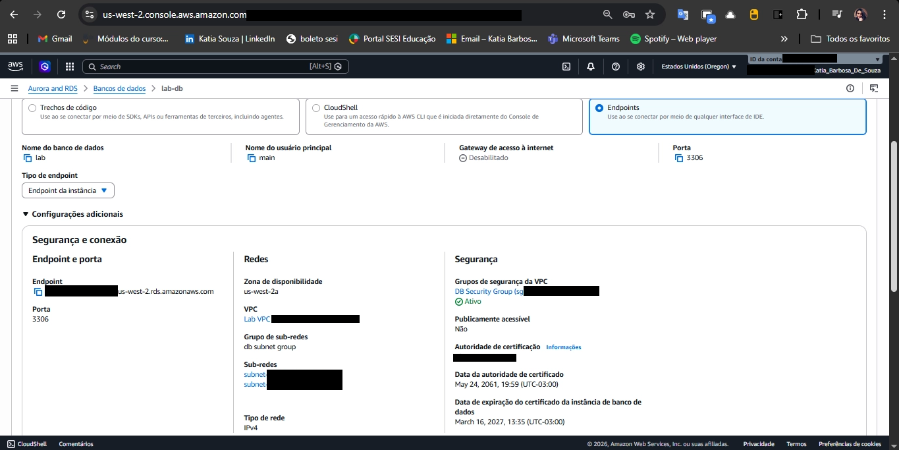
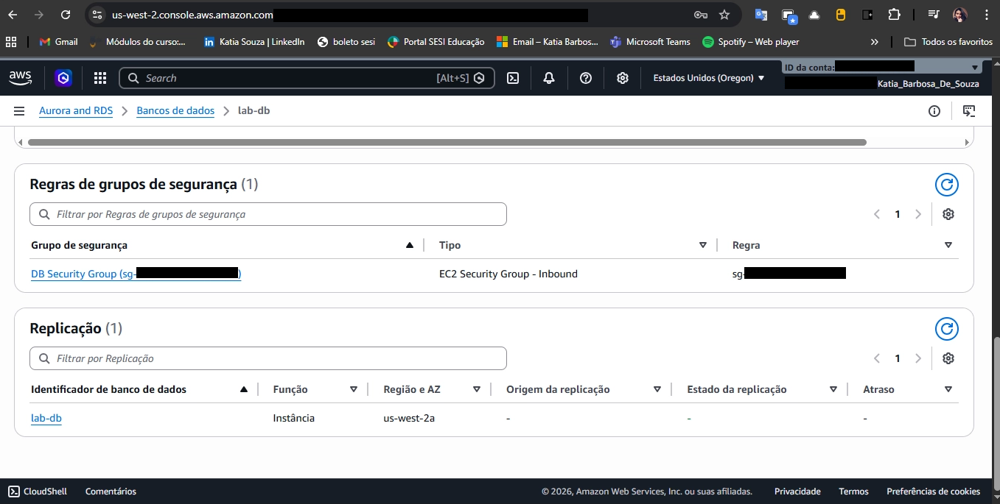
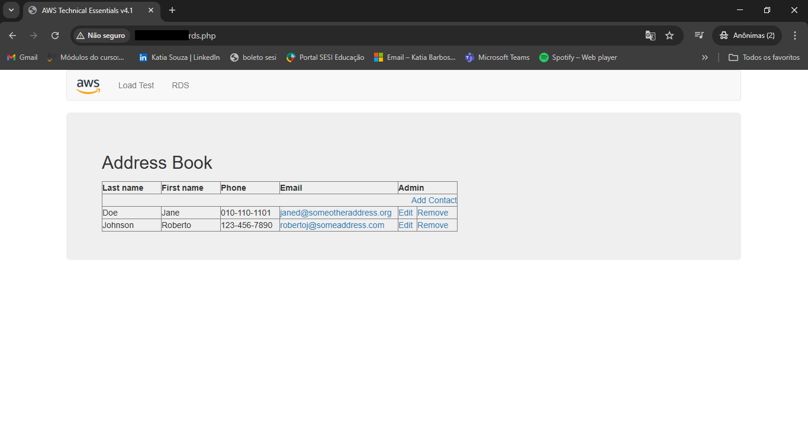

# ☁️ AWS Lab — Criar um Servidor de Banco de Dados e Interagir com Aplicação Web

Laboratório prático realizado durante o curso **AWS Technical Essentials**, da **Escola da Nuvem**, utilizando **Amazon RDS** integrado a uma aplicação web hospedada em **Amazon EC2**.

---

# 📋 Sobre o Laboratório

Este laboratório demonstra como criar uma instância de banco de dados relacional gerenciada pela AWS utilizando **Amazon RDS MySQL**, configurando **alta disponibilidade com Multi-AZ** e permitindo que uma aplicação web interaja com o banco de dados.

O Amazon RDS simplifica a administração de bancos de dados ao automatizar tarefas como:

- Provisionamento de infraestrutura
- Backups
- Atualizações
- Monitoramento
- Failover automático
---

# 🎯 Objetivos

Ao final do laboratório foi possível:

- Executar uma instância **Amazon RDS Multi-AZ**
- Criar **Security Groups** para controle de acesso
- Criar um **DB Subnet Group**
- Conectar uma **aplicação web ao banco de dados**
- Testar leitura e escrita no banco

---

# 🏗️ Arquitetura

## Arquitetura Inicial

Infraestrutura inicial fornecida no laboratório.

Componentes:

- VPC
- Sub-redes públicas e privadas
- Internet Gateway
- NAT Gateway
- Web Server em EC2

---

## Arquitetura Final

Após a criação do banco de dados **Amazon RDS Multi-AZ**.

A arquitetura passou a incluir:

- RDS Primary na AZ A
- RDS Secondary na AZ B
- Replicação automática
- Comunicação segura com o Web Server

---

# 🛠️ Tarefas Realizadas

## Criar Security Group do Banco de Dados

Foi criado um grupo de segurança permitindo acesso ao banco apenas pelo Web Server.

Configuração:

| Tipo | Porta | Origem |
|-----|------|------|
| MySQL/Aurora | 3306 | Web Security Group |

---

## Criar DB Subnet Group

O DB Subnet Group define quais sub-redes privadas podem ser usadas pelo banco.

Sub-redes utilizadas:

| Sub-rede | CIDR | AZ |
|--------|------|------|
| Private Subnet 1 | 10.0.1.0/24 | us-west-2a |
| Private Subnet 2 | 10.0.3.0/24 | us-west-2b |

---

## Criar Instância Amazon RDS

Resumo da instância criada.

Configuração:

| Configuração | Valor |
|--------------|------|
| Identificador | lab-db |
| Engine | MySQL |
| Classe da instância | db.t3.medium |
| Banco inicial | lab |
| Porta | 3306 |
| Disponibilidade | Multi-AZ |
| Acesso público | Não |

---

## Endpoint do Banco de Dados

Endpoint utilizado pela aplicação web para conectar ao banco.

Exemplo de endpoint:
lab-db.xxxxxxxxx.us-west-2.rds.amazonaws.com

---
## Security Group e Replicação
 
Confirmação do DB Security Group ativo e da replicação configurada em `us-west-2a`.
 

---

# 🌐 Aplicação Web

Após configurar o endpoint, a aplicação web foi conectada ao banco.

A aplicação permite:

- adicionar contatos
- editar contatos
- remover contatos

Os dados são armazenados no banco RDS e replicados automaticamente para a segunda AZ.

---

# 🔄 Alta Disponibilidade

O Amazon RDS foi configurado com **Multi-AZ**, garantindo:

- Replicação síncrona automática entre duas Zonas de Disponibilidade
- Failover automático em caso de falha da instância primária
- Maior durabilidade e disponibilidade para cargas de trabalho de produção

---

# 📚 Serviços AWS Utilizados

| Serviço | Função |
|---|---|
| Amazon RDS | Banco de dados gerenciado MySQL |
| Amazon EC2 | Servidor web da aplicação |
| Amazon VPC | Rede isolada com sub-redes públicas e privadas |
| Security Groups | Controle de acesso à instância de banco de dados |
| Multi-AZ | Alta disponibilidade com réplica automática |
| NAT Gateway | Comunicação de sub-redes privadas com a internet |
| Internet Gateway | Acesso externo à VPC |

---

# 💡 Conceitos Aprendidos

Durante este laboratório foram reforçados conceitos como:

- Arquitetura em múltiplas Zonas de Disponibilidade
- Banco de dados gerenciado vs autogerenciado
- Segurança em rede com Security Groups e sub-redes privadas
- Isolamento do banco de dados da camada de aplicação
- Integração entre EC2 e RDS via endpoint
---

# 🎓 Programa

Laboratório realizado durante o programa de formação em nuvem da:

**Escola da Nuvem**

---

# 👩‍💻 Autora

**Katia Barbosa de Souza**

Estudante de **Cloud Computing e Análise de Dados**.

🔗 LinkedIn  

> “A nuvem não é apenas tecnologia — é a porta de entrada para novas oportunidades.” ☁️
